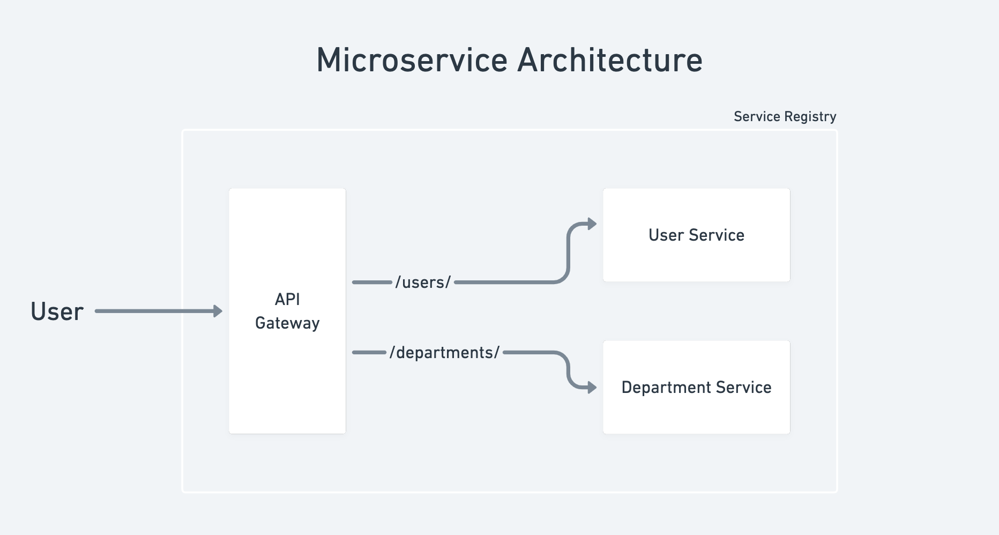

# SpringBoot-Microservices-Example

A simple Microservice Architecture based application implemented in SpringBoot.    

## Implementation

- Created two separate services, namely USER-SERVICE and DEPARTMENT-SERVICE.
- Set up a Service Registry (Netflix Eureka) and connected all services to the Eureka Server.
- Created an API gateway so that all API calls are made through the same URL.

## Dependencies

- Spring Web
- Spring Data JPA
- Lombok
- Spring Cloud Gateway
- Netflix Eureka Server
- Netflix Eureka Client

## To Be Done

Next step is to make it resilient by implementing a Circuit Breaker (resilience4j) so that it handles failures in case any one of the services is down.
